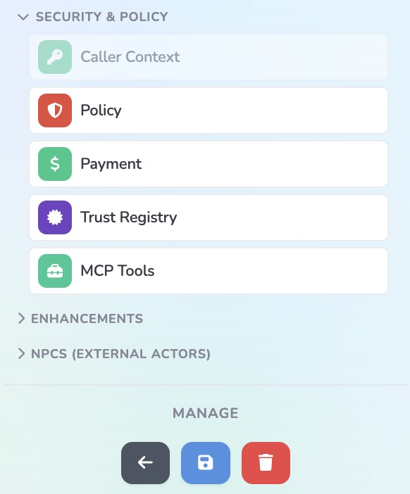
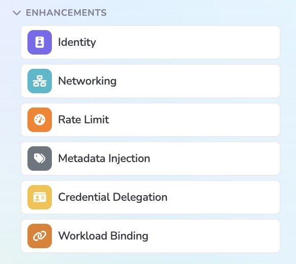

# Working in the gateway dashboard

How the control plane is organised, and the order of operations that makes
configuring a surface a single pass instead of a stop-start one. This describes
the shape of the UI rather than its pixels. Buttons move; the two-tier model and
the build order do not.

> **Figures.** The screenshots in `images/` are for human readers and as a record
> of what the console looked like in August 2026. Everything they show is written
> out below, so an agent should not open them except to check something the text
> does not cover.

Sign-in is by **passkey (WebAuthn)** or, on enterprise deployments, SSO/SAML.

## The one rule: define, then reference

**Gateway level** holds reusable objects belonging to no particular surface:
secrets, credential providers, JWT verification strategies, policy definitions,
managed identities, issuers, authorities, proxies, connections.

**Surface level** is one surface *referencing* those objects and declaring how
this flow uses them.

A surface can only select from what already exists. So the setting you want will
be missing, greyed out, or offering an empty dropdown, not because you are on the
wrong screen but because **the object it selects from has not been created yet**.
Leave the surface, create the object, come back, select it.

| To configure this on a surface | First create this at gateway level |
| --- | --- |
| A key presented to the external target | The secret (**Management → Secrets**) |
| Bearer-token caller authentication | The JWT verification strategy (**Management → Credentials → JWT Verification**) |
| Per-user credential delegation | The secrets, *then* the credential provider |
| A policy on any leg | The policy definition (**Management → Policies**) |
| An MCP or A2A proxy target | The proxy (**Agent → Proxies**) |
| A `fabric://` target | The peer gateway connection (**Configuration → Connections**) |
| A trust check against an external authority | The authority record (**Management → Identity → Authorities**) |

## The gateway's navigation

| Section | Screens | What lives here |
| --- | --- | --- |
| **Dashboard** | — | Connections over time (accepted / denied / faulted), latency percentiles, identity-resolution breakdown by method, top-surfaces table linking into each editor. |
| **Agent** | Surfaces, Proxies | Where agents reach the gateway and where requests go. Proxies covers MCP and A2A proxies. |
| **Management** | Credentials, Policies, Secrets, Identity, Payments | The building blocks a surface references. |
| **Configuration** | Connections, Integrations, Settings *(incl. Users)* | Peer gateways, mediators, trust registries; integrations; system settings. |
| **Monitoring** | Metrics, Logs, Audit, System, Tasks | Live operational views. Tasks is one row per running surface. |

Two screens are tabs rather than top-level items and are easy to hunt for: **JWT
Verification Strategies** under *Management → Credentials*, and **Users** under
*Configuration → Settings*.

**Roles.** Administrator (full access), Power User (mediators and proxies; may
**not** edit surfaces, policies, API keys, certificates or system settings), User
(read-only, plus notifications, issuers and authorities). The UI hides what a
role cannot use, and enforcement is server-side regardless. If a control is
missing rather than greyed, check your role before assuming a version difference.

## Anatomy of a surface

A zoomable, pannable canvas showing the request path as nodes joined by legs:

```
                  ┌──────────────── the surface ────────────────┐
                  │  ←──────── MA → AP response leg ─────────→  │
  caller ────────→│ Access Point ─ ● ─ ● ─→ Managed Agent ──────│──→ External
                  │                 ▲              │            │      Target
                  │      elements dropped on a leg └── Transit ─│──→ other
                  └──────────────────────────────────Point──────┘    endpoint
```


| Canvas element | What it is |
| --- | --- |
| **Surface** (the blue boundary) | The gateway's zone of control. Only what is inside can be configured. |
| **Access Point** | The inbound front door. **Edge-bound** — it moves only along the perimeter. |
| **Managed Agent** | The agent being configured and routed. |
| **External Target** | The real resource, drawn *outside* the boundary because it is outside the gateway. |
| **Transit Point** | An agent-initiated outbound route. |
| **NPCs** | Non-player characters: external actors drawn outside the surface for context — the human user, a third-party service. The gateway cannot modify them; they exist so the diagram expresses the whole workflow including the parts you do not control. |

**Configuration attaches to a leg**, so the same control behaves differently
depending on which leg it sits on. Credential delegation and workload binding go
on the MA→External leg.

### The Access Point URL is the one to hand out

The canvas header shows it with a copy button. The External Target's URL — the
resource's own address — **bypasses everything you configured on this surface**,
and sits in the same editor, which makes copying the wrong one easy. Hand out the
access point URL, and close the direct path so the wrong one stops working. See
`securing-the-resource.md`.

## The editor

| View | What it is for |
| --- | --- |
| **Surface** | The canvas — the default working view |
| **Templates** | Starting points, and saving this surface as one |
| **Elements** | Every configurable element with a status indicator — green for configured, yellow for incomplete. Clicking an incomplete one jumps to it. Faster than scanning a busy canvas. |
| **Monitoring** | Live traffic through this surface |
| **Config** | The raw JSON, editable in place and reflected on the canvas. Copyable between environments, though an import needs work to resolve missing identifiers. A power-user path; the canvas does everything it does. |

**Variants** have their own selector, `base` by default. **Manage** holds back,
save and delete — changes are not live until saved.

### Creating a surface

A short wizard: name it, choose MCP or A2A, then you are in the editor. Take a
**template** — the MCP one opens a working access-point-to-target topology with a
hint balloon, a much better start than an empty canvas.

### Guided validation — marching ants

Elements needing configuration are outlined in animated red, paired with a short
message naming what makes the state invalid. Saving an invalid surface produces
specific errors, each with a **Show Me** button that navigates to the offending
element. Required fields and endpoint formats validate inline.

Treat the ants as the to-do list. A surface with none left is structurally
complete — which is not the same as correctly configured, and says nothing about
whether the ungoverned path is closed.

Useful canvas shortcuts: **Auto Layout** (`Ctrl/Cmd + L`) tidies everything into
axis-aligned lines; **Origin** brings strays back into view; the **camera button**
exports the canvas including NPCs, which is the fastest way to produce an
architecture diagram of a flow.

### The palette

Drag an element onto the leg it should apply to.

| Group | Elements |
| --- | --- |
| **Transit points** | Agent-initiated outbound routes |
| **Security & policy** | Caller Auth · Policy · Payment · Trust Registry · MCP Tools |
| **Enhancements** | Identity · Networking · Rate Limit · Metadata Injection · Credential Delegation · Workload Binding |
| **NPCs** | External actors, for context |

|  |  |
| --- | --- |
| Security & policy | Enhancements |

**Not every element can go on every leg.** While dragging, the canvas highlights
in **green** where the element may be dropped. Use that rather than reasoning
about it — it is fastest, and it is authoritative.

| Element | What it does | Detail |
| --- | --- | --- |
| **Caller Auth** | Verifies the caller's JWT and makes claims available downstream. Without it, claims are empty and `x-caller-did` is `anonymous` | `configuration.md` §2 |
| **Policy** | The OPA/Rego policy. Package must match where it is attached | `configuration.md` §3 |
| **Identity** | Derives the agent's DID and, where enabled, injects a VP | `identity-and-controls.md` §1 |
| **Credential Delegation** | Per-user credential from the vault, on the MA→External leg | `configuration.md` §5 |
| **Workload Binding** | A signed VP per request execution | `identity-and-controls.md` §1 |
| **Metadata Injection** | Merges a payload into outgoing requests | `identity-and-controls.md` §5 |
| **Rate Limit** | Token-bucket limiting; rejects with 429 | `identity-and-controls.md` §4 |
| **MCP Tools** | Per-tool policy | `configuration.md` §3 |
| **Networking** | Timeouts, retries, circuit breaker, mirroring | `identity-and-controls.md` §4 |
| **Trust Registry** | Recognition and authorisation checks | `glossary.md` |
| **Payment** | x402 or MPP payment policy | `glossary.md` |

The **static key presented to the external target** may not be a palette element:
depending on version it is *Target Authentication* on the Managed Agent node, or
an API Key credential binding on the MA→External leg — `configuration.md` §4.

**Partials** are the shortcut worth knowing: rather than dragging and wiring an
element yourself, apply one from **Templates → Partials** and it makes the changes
for you.

## Building a protected resource, in order

1. **Create the prerequisite objects** at gateway level — at minimum the secret
   the surface will present to the target.
2. **Create the surface** from a template, choosing MCP or A2A.
3. **Set the external target** to the resource's URL, with the **full path**.
4. **Configure it** — target authentication, then elements from the palette onto
   the legs they belong on. Green highlight says where; marching ants say what is
   unfinished.
5. **Note the access point URL.** This is what callers use.
6. **Close the direct path** to the external target. Not in the dashboard, and
   easy to skip — see `securing-the-resource.md`.
7. **Verify both directions.** The access point works with no credential of your
   own; the target's own URL returns 401.

Step 1 before step 2 is the whole trick. Step 6 is the one with no error message
attached.

## Notes and open questions

- Palette entries are sometimes greyed out. **Why is not established** — possibly
  a limit of one per surface, since Caller Auth appeared greyed while already
  placed and Identity did not. Do not rely on the reading either way.
- A page reload refreshes the surface route cache — worth doing if a saved change
  does not appear live. Configuration is documented as hot-reloading, so a change
  needing a reload is worth reporting.
- **Listener bindings are startup-only.** Everything else hot-reloads; changing a
  listener's address or port needs a process restart, which on a hosted gateway
  means asking Affinidi.
- The console has been reorganised at least once. Where a screen is not where this
  file says, trust the console and note the drift.
